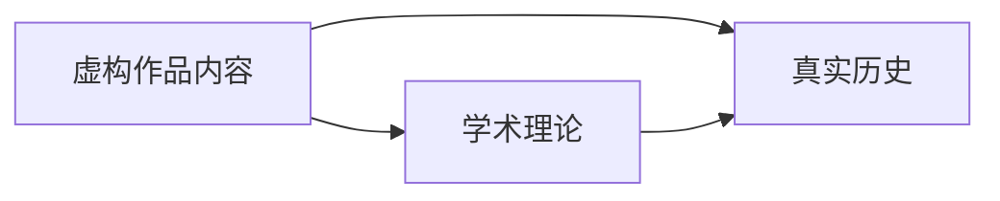
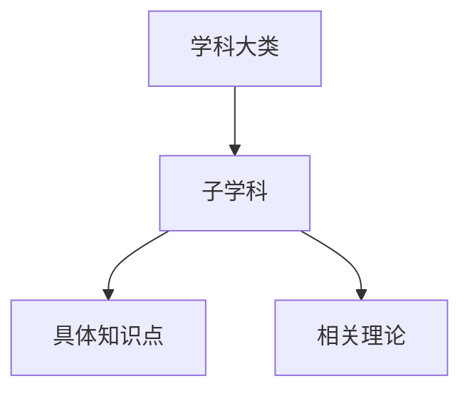

# ACG 知识手册库 — 项目结构规范

> 本文档面向开发者、内容贡献者和项目维护者。如果你只是想浏览内容，请直接访问 [项目主页](https://wudioql.github.io/Knowledge-based_ACG_works/) 或阅读 [README.md](../README.md)。

---

## 项目架构

### 技术哲学

本项目选择**原生技术栈**（HTML5 + CSS3 + Vanilla JavaScript），基于以下考量：

- **零依赖**：无需 npm、构建工具或框架升级，项目可独立运行十年以上
- **零构建**：保存即生效，贡献者无需学习构建流程
- **透明可控**：每一行代码都直接作用于页面，无抽象层带来的调试成本
- **GitHub Pages 原生友好**：静态文件直接托管，无需额外配置

### 目录结构

```
acg-knowledge-handbook/
├── index.html                      # 项目主页（落地页）
├── .nojekyll                       # 禁用 Jekyll 处理（GitHub Pages 配置）
├── .github/
│   └── workflows/
│       └── deploy.yml              # GitHub Actions 自动部署工作流
├── _shared/                         # 项目级共享资源
│   ├── style.css                   # 主页样式表
│   ├── home-button.css             # 主页按钮样式
│   └── home-button.js              # 主页按钮注入脚本
└── doc/                             # 作品内容目录
    ├── maoyuu/                      # 魔王勇者（政治经济学手册）
    │   ├── index.html               # 作品首页
    │   ├── glossary.html            # 术语表
    │   ├── references.html          # 参考文献
    │   ├── vol-01-*.html            # 各卷内容页（8 卷 + 番外）
    │   └── _shared/                 # 作品级共享资源
    │       ├── style.css            # 作品样式表
    │       └── script.js            # 作品交互脚本
    └── shokugeki_no_soma/           # 食戟之灵（料理全鉴）
        ├── index.html               # 作品首页
        ├── arc-*.html               # 各篇章内容页（10 个篇章）
        └── _shared/                 # 作品级共享资源
            ├── style.css            # 作品样式表
            └── script.js            # 作品交互脚本
```

### 技术栈

| 类别 | 技术 | 说明 |
|------|------|------|
| 页面结构 | HTML5 | 语义化标签，无框架 |
| 样式 | CSS3 | CSS 变量 + 原生选择器，无预处理器 |
| 交互 | Vanilla JavaScript | 模块化函数，无框架 |
| 字体 | Google Fonts（在线引入） | 每部作品独立选择，参见[字体政策](#字体政策) |
| 部署 | GitHub Actions + GitHub Pages | 推送即部署 |
| 构建工具 | 无 | 纯静态，零构建 |

---

## 模块体系

### 核心模块

#### `index.html` — 项目主页

- 展示所有作品手册入口卡片
- 显示项目统计数据（作品数、知识点数、学科领域数）
- 包含 Hero 区域和 About 区域

#### `_shared/style.css` — 项目级样式

- 定义全局 CSS 变量（颜色、字体、间距）
- 包含 Header、Hero、Works Card、Footer 样式
- 定义学科标签颜色类（经济、政治、历史等）

#### `_shared/home-button.css` / `home-button.js` — 主页按钮

- 固定定位的圆形返回主页按钮，悬停显示「主页」标签
- **由 CI/CD 在部署时自动注入到所有 `doc/` 下的 HTML 文件**
- 根据 URL 深度动态计算返回主页的相对路径

### 作品模块

每个作品模块拥有**完全独立**的样式和脚本，不要求遵循统一的变量命名或组件结构。基本目录结构如下：

```
doc/<work-id>/
├── index.html               # 作品入口页
├── content-*.html           # 内容页（按[内容拆分政策](#内容拆分政策)组织）
├── glossary.html            # 术语表（可选）
├── references.html          # 参考文献（可选）
└── _shared/
    ├── style.css            # 作品专属样式（完全独立编写）
    ├── script.js            # 作品交互脚本（完全独立编写）
    └── assets/              # 作品资源（SVG、图片等，可选）
```

#### 现有作品实例

| 作品 ID | 目录 | 知识领域 | 内容类型 | 内容页命名 |
|---------|------|----------|----------|------------|
| maoyuu | `doc/maoyuu/` | 政治经济学 | 手册 | `vol-01-*.html` ~ `vol-08-*.html` |
| shokugeki | `doc/shokugeki_no_soma/` | 料理学 | 全鉴 | `arc-01-*.html` ~ `arc-10-*.html` |

---

## 视觉身份差异化指南

> **核心原则**：本项目坚持「一作一貌」的设计理念——每部 ACG 作品的知识手册都应拥有独立的视觉个性，反映原作的内容气质。新作品**不应**复制现有作品的页面骨架、字体组合、布局模式或组件结构。

### 差异化检查清单

在开始新作品的视觉设计前，**必须**确认以下维度与已有作品存在显著差异：

#### 1. 字体组合（必须不同）

标题字体和正文字体**至少有一项**与已有作品不同。参见[字体政策](#字体政策)获取推荐组合。

#### 2. 色彩体系（必须不同）

- 主色（accent）不得与已有作品的主色相同或相近
- 背景色调（冷色 / 暖色 / 中性）应有意识地区分
- 建议使用 [coolors.co](https://coolors.co) 等工具生成色板后，与已有作品对比

#### 3. 页面骨架（鼓励不同）

现有作品使用的骨架：

| 作品 | 页面骨架 |
|------|----------|
| 魔王勇者 | header → hero(gradient + stats) → main(container) → footer |
| 食戟之灵 | header → hero(gradient + stats) → main(container) → footer |

新作品应考虑替代方案，例如：

- 无 hero 区，直接进入内容导航
- 使用全宽 banner 而非 gradient hero
- 使用侧边栏布局而非单栏
- 使用分屏（split-screen）首页设计
- 使用杂志式排版（多栏混排）

#### 4. 布局模式（鼓励不同）

现有作品使用的布局：

| 作品 | 布局模式 |
|------|----------|
| 魔王勇者 | 卡片网格 + 左侧固定 TOC |
| 食戟之灵 | 卡片网格 + 右侧浮动 TOC |

新作品应考虑替代方案，例如：

- 垂直时间线布局（适合历史类内容）
- 双栏对照布局（适合对比分析类内容）
- 瀑布流布局（适合图鉴类内容）
- 标签页切换布局（适合多维度分类内容）
- 长文阅读式布局（适合叙事类内容）

#### 5. 交互模式（按需选择）

现有作品使用的交互：

| 作品 | 交互组件 |
|------|----------|
| 魔王勇者 | 筛选栏、可折叠内容区、侧边目录滚动高亮、返回顶部 |
| 食戟之灵 | 筛选栏、可折叠内容区、侧边目录滚动高亮、返回顶部 |

新作品应评估哪些交互真正需要，而非默认全部实现。例如：

- 时间线类内容可能更适合「按年代筛选」而非「按学科筛选」
- 图鉴类内容可能更适合「搜索 + 网格」而非「分类标签 + 折叠」
- 叙事类内容可能不需要筛选功能

### 禁止事项

- **禁止**新作品直接复制现有作品的 `_shared/style.css` 后仅修改色值
- **禁止**新作品使用与已有作品完全相同的字体组合
- **禁止**新作品套用现有作品的 HTML 模板仅替换文案

### 已有作品视觉档案

| 作品 | 标题字体 | 正文字体 | 主色 | 色调 | 骨架 | 布局 |
|------|----------|----------|------|------|------|------|
| 魔王勇者 | Lora | WorkSans | #8B0000 | 冷学术 | header→hero→main→footer | 卡片网格 + 左侧 TOC |
| 食戟之灵 | Lora | WorkSans | #C0392B | 暖料理 | header→hero→main→footer | 卡片网格 + 右侧 TOC |

> 新作品添加后，请更新此表格，以便后续贡献者查阅。

---

## 字体政策

### 基本规则

1. **必须使用在线字体**：通过 Google Fonts 的 CSS `@import` 引入，**不使用本地字体文件**（不将 .woff/.woff2/.ttf 等文件放入仓库或作品目录）
2. **每部作品必须选择独立的字体组合**：标题字体和正文字体至少一项与已有作品不同
3. **字体必须支持中文显示**：标题字体需具有良好的中文排版效果
4. **每部作品最多使用 2 款字体**（1 标题 + 1 正文），避免加载过多字体资源

### 引入方式

```css
@import url('https://fonts.googleapis.com/css2?family=字体名:ital,wght@0,400;0,700;1,400&display=swap');
```

### 按作品气质的字体推荐

> 以下推荐基于 Google Fonts 可用字体。中文字体文件较大，优先选择支持按需加载的方案。

#### 学术 / 政治 / 历史类

| 用途 | 推荐字体 | 备选 | 气质描述 |
|------|----------|------|----------|
| 标题 | Noto Serif SC | Source Han Serif | 传统学术，庄重典雅 |
| 正文 | Noto Sans SC | Source Han Sans | 清晰易读，现代感 |

#### 料理 / 生活 / 日常类

| 用途 | 推荐字体 | 备选 | 气质描述 |
|------|----------|------|----------|
| 标题 | Playfair Display | Cormorant Garamond | 优雅精致，有手工感 |
| 正文 | Lato | Mulish | 温暖友好，可读性强 |

#### 奇幻 / 冒险 / 战斗类

| 用途 | 推荐字体 | 备选 | 气质描述 |
|------|----------|------|----------|
| 标题 | Cinzel | MedievalSharp | 中世纪 / 史诗感 |
| 正文 | Raleway | Quicksand | 轻盈现代，与标题形成对比 |

#### 科幻 / 科技 / 未来类

| 用途 | 推荐字体 | 备选 | 气质描述 |
|------|----------|------|----------|
| 标题 | Orbitron | Rajdhani | 科技感，几何化 |
| 正文 | Exo 2 | Fira Sans | 未来感但不失可读性 |

#### 悬疑 / 推理 / 恐怖类

| 用途 | 推荐字体 | 备选 | 气质描述 |
|------|----------|------|----------|
| 标题 | Creepster | Nosifer | 恐怖氛围（仅英文部分） |
| 正文 | Merriweather | Crimson Text | 衬线体，经典悬疑感 |

### 注意事项

- 装饰性字体仅用于标题或特殊元素，不用于正文
- 中文字体文件较大，建议正文使用系统中文字体作为 fallback，仅标题使用 Google Fonts 的中文字体
- 需在作品 `style.css` 中通过 `@import` 引入，定义 `--font-heading` 和 `--font-body` 变量

---

## 内容拆分政策

### 基本原则

内容**必须**按章节 / 卷 / 篇章拆分为独立 HTML 文件，避免单文件过大导致加载缓慢和编辑困难。

### 文件大小限制

| 指标 | 上限 | 说明 |
|------|------|------|
| 单个 HTML 文件 | **≤ 150 KB**（含内容） | 超过此大小应考虑拆分 |
| 单个 CSS 文件 | **≤ 50 KB** | 作品级共享样式表 |
| 单个 JS 文件 | **≤ 20 KB** | 作品级共享脚本 |

### 拆分规则

#### 按叙事结构拆分（推荐）

- **卷制作品**（如魔王勇者）：每卷一个 HTML 文件，命名 `vol-XX-简述.html`
- **篇章制作品**（如食戟之灵）：每篇章一个 HTML 文件，命名 `arc-XX-简述.html`
- **章节制作品**：每章一个 HTML 文件，命名 `ch-XX-简述.html`
- **话数制作品**：按话数范围分组（如 1-10 话、11-20 话），每组一个文件

#### 辅助页面独立

以下内容应独立为单独的 HTML 文件：

- 术语表 / 名词解释 → `glossary.html`
- 参考文献 / 资料来源 → `references.html`
- 人物关系图 → `characters.html`
- 索引页 → `index.html`

#### 超限二次拆分

当一个章节 / 卷的内容超过 150 KB 时：

1. 按知识点 / 条目分组，将部分内容移至独立文件
2. 使用交叉引用（cross-ref）链接相关内容
3. 在索引页提供清晰的导航结构

### 文件命名规范

- 使用小写字母和连字符：`vol-01-agricultural-revolution.html`
- 编号使用两位数前导零：`vol-01`、`arc-01`
- 名称使用英文简述，反映内容主题
- 避免使用中文文件名（兼容性问题）

### 导航要求

- 每个内容页必须有「上一章 / 下一章」导航
- 索引页必须提供到所有内容页的链接
- 内容页之间通过交叉引用建立知识网络

---

## 可视化规范

### 总体原则

合理使用 Mermaid 图表、SVG 图示和 HTML/CSS 图表来优化知识的视觉呈现，但不应过度使用导致页面加载缓慢或内容冗余。

### Mermaid 图表

#### 适用场景

- **关系图**：人物关系、概念关联、因果链条
- **流程图**：事件发展流程、决策树、工艺步骤
- **时间线**：历史事件序列（使用 `timeline` 或 `gantt`）
- **对比矩阵**：多维度对比分析

#### 不适用场景

- 简单的 2-3 项列表（直接用 HTML 列表即可）
- 需要精确像素控制的复杂图表（应使用 SVG）
- 移动端需要频繁缩放才能阅读的大型图表

#### 使用规范

- Mermaid 代码块放在 `<pre class="mermaid">` 标签中
- 需引入 Mermaid CDN：

```html
<script src="https://cdn.jsdelivr.net/npm/mermaid/dist/mermaid.min.js"></script>
```

- 图表应配有简短的文字说明（`aria-label` 或相邻段落）
- 复杂图表应提供移动端的折叠 / 展开控制
- 每页 Mermaid 图表数量不超过 5 个

#### 示例

三方对照关系图（已在 README.md 中使用）：



知识体系层级图：



### SVG 图示

#### 适用场景

- 作品标志 / 图标
- 地图 / 地理位置标注
- 流程图中的自定义图形
- 需要精确控制样式的图表

#### 使用规范

- SVG 代码可直接内联在 HTML 中（小图标）或作为独立 `.svg` 文件引用
- 内联 SVG 应设置 `width` 和 `height` 属性，使用 `viewBox` 保证响应式
- 独立 SVG 文件放在作品的 `_shared/assets/` 目录下
- 单个内联 SVG 不超过 10 KB，超过此大小应独立为文件
- 必须添加 `aria-label` 或 `<title>` 提供无障碍描述

### HTML/CSS 图表

#### 适用场景

- 统计数据展示（柱状图、饼图可用纯 CSS 实现）
- 对比表格（如魔王勇者的三方对照表）
- 进度条 / 评级展示（如食戟之灵的料理评分）

#### 使用规范

- 优先使用语义化 HTML（`<table>`、`<dl>`、`<progress>`）
- 复杂图表可使用轻量级库（如 Chart.js），但需评估文件大小影响
- 所有图表必须有文字替代内容（`aria-label` 或相邻说明文字）

### 性能约束

| 资源类型 | 单页上限 | 说明 |
|----------|----------|------|
| Mermaid 图表 | ≤ 5 个 | 过多图表影响页面加载 |
| 内联 SVG | ≤ 10 KB / 个 | 大型 SVG 应独立为文件 |
| Chart.js | 仅在必要时引入 | 评估对页面加载的影响 |
| 额外 CDN | 最多 2 个 | 除 Google Fonts 和 Mermaid 外 |

---

## 开发规范

### 文件组织规范

- 作品目录使用**小写英文 + 下划线**，如 `shokugeki_no_soma`
- 内容页文件名使用**前缀 + 描述**，如 `vol-01-agricultural-revolution.html`
- 共享资源必须放在 `_shared/` 子目录中
- 所有 HTML 文件使用语义化标签（`header`、`main`、`section`、`article`、`footer`）

### CSS 命名约定（现有作品参考）

> **注意**：以下命名约定基于现有作品总结，仅供新作品参考。新作品**不必**遵循相同的命名模式，但应保持自身内部的一致性。

| 前缀 | 用途 | 示例 |
|------|------|------|
| `.site-` | 全局站点元素 | `.site-header`、`.site-nav`、`.site-footer` |
| `.hero-` | 首屏区域 | `.hero-title`、`.hero-lead` |
| `.works-` | 作品卡片区域 | `.works-grid`、`.works-card` |
| `.vol-` | 魔王勇者卷卡 | `.vol-card`、`.vol-title` |
| `.arc-` | 食戟之灵篇章卡 | `.arc-card`、`.arc-title` |
| `.topic-` | 知识点卡片 | `.topic-card`、`.topic-meta` |
| `.dish-` | 料理卡片 | `.dish-card`、`.dish-recipe` |
| `.filter-` | 筛选器控件 | `.filter-group`、`.filter-btn` |
| `.collapsible-` | 可折叠内容 | `.collapsible-header`、`.collapsible-body` |
| `.side-toc` | 侧边目录 | `.side-toc-list`、`.side-toc-link` |
| `.back-to-top` | 返回顶部 | `.back-to-top` |
| `.disc-tag-` | 学科标签 | `.disc-tag-econ`、`.disc-tag-politics` |

### CSS 变量系统（现有作品参考）

> **注意**：以下变量基于现有作品总结。新作品的变量命名和数量不必与此一致，但建议使用 CSS 自定义属性来管理设计令牌。

#### 魔王勇者变量体系

```css
:root {
  /* 全局颜色 */
  --bg: #FAFAF5;              /* 背景色 */
  --bg2: #F0EDE5;             /* 次要背景 */
  --ink: #1A1A2E;             /* 主文字色 */
  --muted: #6B7280;           /* 次要文字 */
  --rule: #D4CFC5;            /* 分隔线 */
  --accent: #8B0000;          /* 主强调色（暗红） */
  --accent2: #B8860B;         /* 次强调色（暗金） */

  /* 学科颜色 */
  --disc-econ: #1565C0;       /* 经济学 */
  --disc-politics: #C62828;   /* 政治学 */
  --disc-history: #2E7D32;    /* 历史学 */
  --disc-tech: #00838F;        /* 技术 */
  --disc-philosophy: #6A1B9A;  /* 哲学 */

  /* 字体 */
  --font-heading: 'Lora', serif;
  --font-body: 'WorkSans', sans-serif;
}
```

#### 食戟之灵变量体系

```css
:root {
  /* 全局颜色 */
  --bg: #FFF8F0;              /* 背景色（暖奶油） */
  --bg2: #FFF0E0;             /* 次要背景 */
  --ink: #2C3E50;             /* 主文字色（深蓝灰） */
  --muted: #7F8C8D;           /* 次要文字 */
  --rule: #E0D5C8;            /* 分隔线 */
  --accent: #C0392B;          /* 主强调色（亮红） */
  --accent2: #F39C12;         /* 次强调色（亮橙金） */

  /* 料理体系颜色 */
  --tag-jp: #C0392B;          /* 日式 */
  --tag-fr: #1565C0;          /* 法式 */
  --tag-it: #2E7D32;          /* 意式 */
  --tag-cn: #E67E22;          /* 中式 */
  --tag-other: #6A1B9A;       /* 其他 */
  --tag-molecular: #00838F;   /* 分子美食学 */

  /* 字体 */
  --font-heading: 'Lora', serif;
  --font-body: 'WorkSans', sans-serif;
}
```

### JavaScript 模块规范

- 每个作品 `script.js` 使用立即执行函数（IIFE）封装，避免全局污染
- 功能按 `initXxx()` 函数拆分，在 DOMContentLoaded 时统一调用
- 优先使用原生 DOM API，避免引入外部库
- 事件委托优先于逐个元素绑定

---

## 添加新作品指南

### 前置条件

在开始开发前，请确认以下事项：

- [ ] 已确定要整理的 ACG 作品名称
- [ ] 已明确知识领域和内容类型（手册 / 全鉴 / 年表 / 地图）
- [ ] 已阅读[视觉身份差异化指南](#视觉身份差异化指南)
- [ ] 已完成差异化检查清单，确认与已有作品存在显著差异

### Step 1：创建目录结构

```bash
doc/<work-id>/
├── index.html              # 作品首页
├── _shared/
│   ├── style.css           # 作品样式（完全独立编写）
│   ├── script.js           # 作品脚本（完全独立编写）
│   └── assets/             # 作品资源（SVG、图片等，可选）
└── (内容页).html            # 按内容拆分政策创建
```

### Step 2：选择字体

- [ ] 参考[字体政策](#字体政策)，按作品气质选择字体组合
- [ ] 确认字体组合与已有作品不同（标题和正文至少一项不同）
- [ ] 在 `style.css` 中通过 `@import` 引入 Google Fonts
- [ ] 定义 `--font-heading` 和 `--font-body` 变量

### Step 3：设计色彩体系

- [ ] 选择主色（accent），确认与已有作品不同
- [ ] 定义背景色、文字色、辅助色
- [ ] 建议使用 [coolors.co](https://coolors.co) 等工具生成完整色板
- [ ] 将色值定义为 CSS 自定义属性

### Step 4：设计页面骨架与布局

- [ ] 参考[视觉身份差异化指南](#视觉身份差异化指南)的差异化检查清单
- [ ] 确认页面骨架与已有作品不同（或有意选择相同但有充分理由）
- [ ] 确认布局模式与已有作品不同
- [ ] 评估需要哪些交互组件（筛选、折叠、TOC 等），按需选择

### Step 5：编写内容

- [ ] 按章节 / 卷 / 篇章拆分内容为独立 HTML 文件
- [ ] 确认每个文件不超过 150 KB
- [ ] 在适当位置使用 Mermaid 图表 / SVG / HTML 图表增强可视化
- [ ] 为每个内容页添加「上一章 / 下一章」导航
- [ ] 在索引页提供完整的导航结构

### Step 6：创建索引页

- [ ] 在 `index.html` 中展示作品概览
- [ ] 提供到所有内容页的链接
- [ ] 展示作品统计数据

### Step 7：注册到项目主页

- [ ] 在项目根 `index.html` 的 `.works-grid` 中添加作品卡片
- [ ] 定义作品卡片 banner 的背景色 / 样式
- [ ] 更新 README.md 的作品总览表格
- [ ] 更新本文档的「已有作品视觉档案」表格和「现有作品实例」表格

### Step 8：测试与部署

- [ ] 本地预览确认所有页面正常显示
- [ ] 检查移动端响应式效果
- [ ] 检查所有链接有效
- [ ] 推送到 GitHub，确认 CI/CD 自动部署成功
- [ ] 确认主页按钮自动注入正常工作

---

## 部署架构

### GitHub Actions 工作流

`.github/workflows/deploy.yml` 负责自动部署：

```
触发条件:
  - push 到 main/master 分支
  - 手动 workflow_dispatch

步骤:
  1. Checkout code
  2. 遍历 doc/ 下所有 .html 文件
     - 计算相对路径深度
     - 注入 home-button.css 链接到 </head>
     - 注入 home-button.js 脚本到 </body>
  3. Upload artifact
  4. Deploy to GitHub Pages
```

### 主页按钮注入逻辑

部署时，工作流自动为每个 `doc/` 下的 HTML 文件注入返回主页的按钮：

- 解析文件路径，计算相对于项目根的深度
- 生成对应的 `../` 前缀
- 在 `</head>` 前注入 `<link rel="stylesheet" href="{prefix}_shared/home-button.css">`
- 在 `</body>` 前注入 `<script src="{prefix}_shared/home-button.js"></script>`

---

## 设计模式

### HTML 页面结构（参考模板）

> **注意**：以下模板基于现有作品总结，仅供新作品参考。新作品**不应**直接套用此模板，而应根据[视觉身份差异化指南](#视觉身份差异化指南)设计独立的页面结构。

#### 现有作品使用的模板

```html
<!DOCTYPE html>
<html lang="zh-CN">
<head>
  <meta charset="UTF-8">
  <meta name="viewport" content="width=device-width, initial-scale=1.0">
  <title>页面标题 | 作品名称 | ACG 知识手册库</title>
  <link rel="stylesheet" href="_shared/style.css">
  <!-- home-button.css 由 CI/CD 自动注入 -->
</head>
<body>
  <header class="site-header">...</header>

  <section class="hero">
    <h1>页面标题</h1>
    <p class="hero-lead">页面描述</p>
  </section>

  <main class="container">
    <!-- 内容区域 -->
  </main>

  <footer class="site-footer">...</footer>
  <button class="back-to-top" aria-label="返回顶部">↑</button>

  <script src="_shared/script.js"></script>
  <!-- home-button.js 由 CI/CD 自动注入 -->
</body>
</html>
```

### 依赖关系

```
index.html
├── _shared/style.css
└── (无 JS)

doc/<work-id>/*.html
├── doc/<work-id>/_shared/style.css
├── _shared/home-button.css    ← CI/CD 注入
└── _shared/home-button.js     ← CI/CD 注入
    └── doc/<work-id>/_shared/script.js
```

---

## 内容数据

### 魔王勇者 — 知识体系

| 学科 | 知识点数 | 代表概念 |
|------|----------|----------|
| 经济学 | 12 | 比较优势、重商主义、通货膨胀 |
| 政治学 | 12 | 社会契约论、三权分立、博弈论 |
| 历史学 | 12 | 农业革命、宗教改革、金融革命 |
| 技术制度 | 5 | 技术创新、专利制度、教育制度 |
| 思想哲学 | 5 | 启蒙运动、女性主义、骑士精神 |

**核心学者**：亚当·斯密、大卫·李嘉图、凯恩斯、熊彼特、洛克、卢梭、孟德斯鸠等

### 食戟之灵 — 料理体系

| 篇章 | 话数范围 | 料理数 |
|------|----------|--------|
| 入学篇 | 1-13 话 | ~12 |
| 住宿研修 | 14-27 话 | ~20 |
| 秋季选拔 | 28-60 话 | ~23 |
| 食戟 vs 久我 | 61-87 话 | ~16 |
| 实习篇 | 88-106 话 | ~11 |
| 月飨祭 | 107-137 话 | ~17 |
| 远月列车 | 138-158 话 | ~10 |
| 联队食戟 | 159-217 话 | ~29 |
| THE BLUE | 218-315 话 | ~55 |
| 番外篇 | 3 话 | ~5 |

**料理体系**：日式、法式、意式、中式、东南亚、分子美食学等
